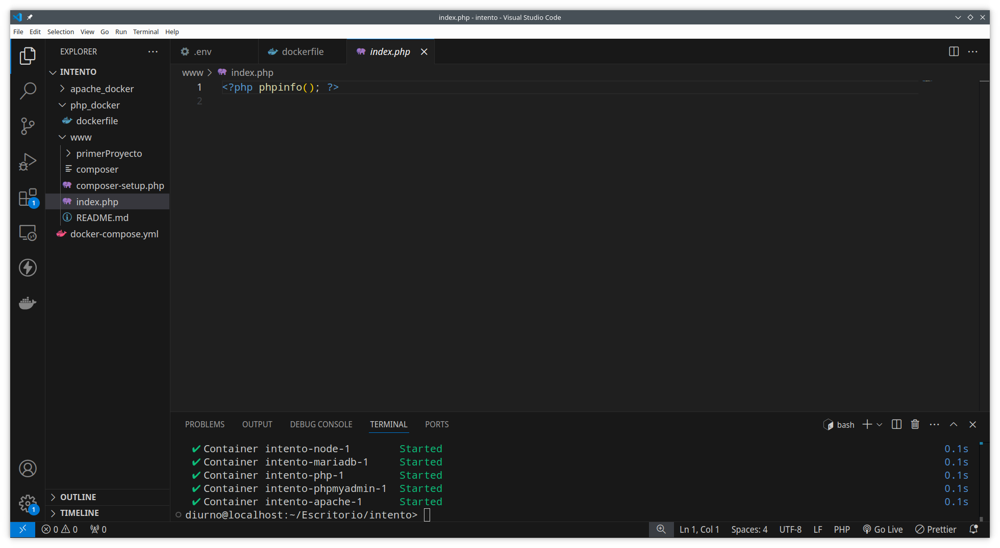

# Actividad 5.3

En esta actividad he creado un docker-compose.yml, este archivo usa las imagenes
- node
- php
- apache
- mariadb
- phpmyadmin

Además hago uso de un dockerfile para la instalacion de php

## Dockerfile
El dockerfile está configurado de la siguiente manera:  
```
FROM php:8.2-fpm

RUN apt update && \
    apt install -y zip libzip-dev libpng-dev libicu-dev libxml2-dev

RUN docker-php-ext-install mysqli pdo pdo_mysql gd zip intl xml

RUN apt clean
```
Descargo la imagen php:8.2-fpm y con la instruccion run ejecuto comandos de bash, las instrucciones son:
- apt update: actualiza los paquetes
- apt install -y zip libzip-dev libpng-dev libicu-dev libxml2-dev: instala los paquetes, instala zip y las bibliotecas de desarrollo libzip y libpng, instala las herramientas ICU e instala libxml2
- Además instala las extensiones de xml, msqli, pdo, zip, intl, gd
- apt clean limpia la caché local de los paquetes descargados


## Node
La configuración de node en el docker compose es el siguiente
```
  node:
    image: docker.io/bitnami/node:latest
    ports:
      - 3000:3000
    volumes:
      - ./www/:/var/www/html/
    tty: true
```

- node: es el nombre del servicio
- image: la imagen de node que uso es la ultima version de docker.io/bitnami/node
- ports: los puertos con los que se conecta el contenedor con la maquina host es el 3000:3000
- volumes: el lugar donde persisten los datos de node es en el directorio /var/www/html/
- tty: asigne un dispositivo de terminal al contenedor

## php
La configuración de php en el docker compose es el siguiente

```
  php:
    build: './php_docker/'
    volumes:
      - ./www/:/var/www/html/
```
- build: construye una imagen a partir de un dockerfile que se encuentra en /php_docker/
- volumes el lugar donde los archivos se guardarán será en /var/www/html/

## Apache
La configuracion de apache es el siguiente:  

```
  apache:
    build: './apache_docker/'
    depends_on:
      - php
    ports:
      - "80:80"
    volumes:
      - ./www/:/var/www/html/   
```

- depends on: depende del funcionamiento de php
- ports: los puertos con el que está conectado con el host es el 80:80
- volumes: apache mantiene sus datos en el directorio /var/www/html/

## mariadb
La configuración de mariadb es la siguiente:  
```
    mariadb:
    image: mariadb:10.11
    environment:
      MYSQL_ROOT_PASSWORD: password123
    volumes:
      - mysqldata:/var/lib/mysql
```
- image: la imagen que usa es la version 10.11 de mariadb
- enviorement: mariadb necesita la contraseña root de mysql, en este caso la contraseña es password123
- volumes: mariadb guarda sus datos en el directorio /var/lib/mysql

## phpmyadmin
La configuración de phpmyadmin es:

```
    phpmyadmin:
    image: phpmyadmin/phpmyadmin:latest
    ports:
      - 8080:80
    environment:
      PMA_HOST: mariadbhe 
    depends_on:
      - mariadb
```

- image: usa la ultima version de phpmyadmin/phpmyadmin
- ports: los puertos de comunicacion entre el contenedor y el host es el 8080:80
- environment: el host que usa php es el host de mariadb
- depends_on: depende del funcionamiento de mariadb
  
Dentro del proyecto he tenido que hacer lo siguiente:

He hecho un docker-compose up -d, una vez arrancado el contenedor le he hecho click en el boton de la esquina inferior izquierda de color azul > attach to a runnuing container > he seleccionado la opciopn php-1, donde se abrirá una nueva ventana de visual studio, donde he abierto una nueva terminal y he descargado composer.




Para descargar composer he hecho uso de los comandos proporcionados por la web oficial:  

```
php -r "copy('https://getcomposer.org/installer', 'composer-setup.php');"
php -r "if (hash_file('sha384', 'composer-setup.php') === 'dac665fdc30fdd8ec78b38b9800061b4150413ff2e3b6f88543c636f7cd84f6db9189d43a81e5503cda447da73c7e5b6') { echo 'Installer verified'.PHP_EOL; } else { echo 'Installer corrupt'.PHP_EOL; unlink('composer-setup.php'); exit(1); }"
php composer-setup.php
php -r "unlink('composer-setup.php');"
sudo mv composer.phar /usr/local/bin/composer
```
Por ultimo he creado un proyecto laravel con el comando 

```
composer create-project laravel/laravel nombro del proyecto
```

De esta forma se generaá automaticamente todos los archivos que nuestro proyecto necesita.
Tambien he configurado el archivo env para el uso de la base de datos que usará mi proyecto:  

```
DB_CONNECTION=mysql
DB_HOST=mariadb
DB_PORT=3306
DB_DATABASE=laravel
DB_USERNAME=root
DB_PASSWORD=password123
```


Una vez hecho esto he hecho una migración para crear la base de datos de mi proyecto en phpmyadmin con:  

```
php artisan migrate
```

Para ejecutar la aplicación he usado el comando

```
php artisan serve --host=0.0.0.0 --port=8000
```

De esta manera si busco http://localhost:8000/ me llevará a la ruta "/" que en mi proyecto nos lleva a una lista de gatos


